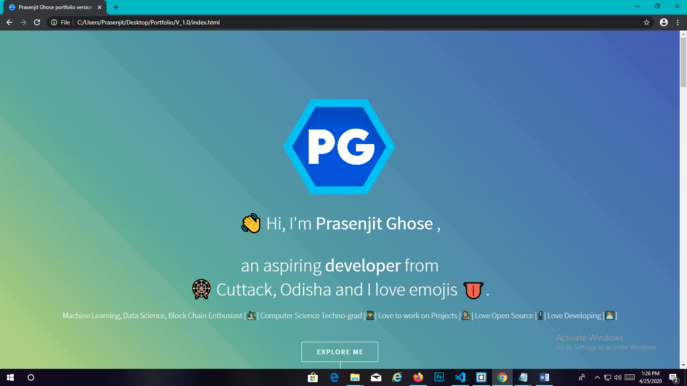
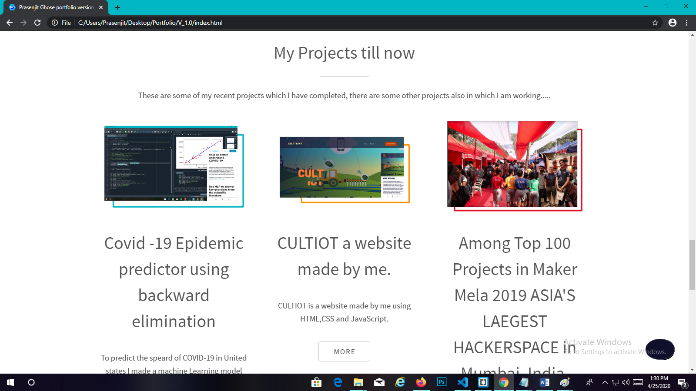
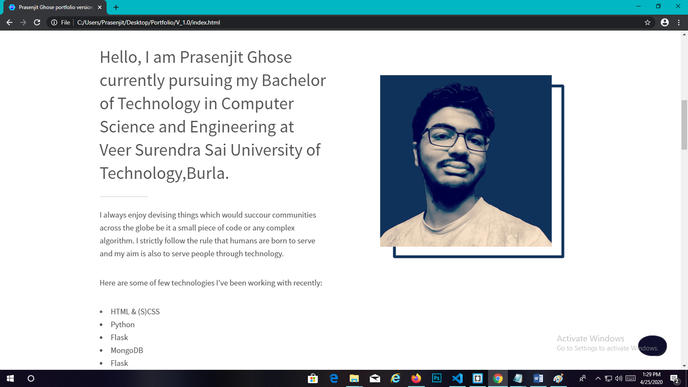

                                 
First Version of my Portfolio and this version 1.2.0 as I made some changes.

I made this website from scratch by using HTML, JavaScript and CSS (sass)

I have pushed the whole project files in my repository if you like my portfolio website then please do give a star and if you want you can use this website.

But as you know plagiarism is a bad character so if you are using this template then please don�t forget to mention me in your website link back to my github profile 

My github profile is:  https://github.com/prasenjitghose36

And if you have any website in your mind which you think I can create then please mail me to hire me as your web designer or as a developer.

------------------Feel free to mail me any time-------------------------
My mail address:-prasenjitghose36@gmail.com

Tools and Software used for my portfolio projects are:-
1. Brackets
2. Microsoft visual Studio
3. Adobe Photoshop and Illustrator
4. Darkmode.js resources found on web
5. Flaticons for icons and webicons
6. HTML5Up for template idea.

